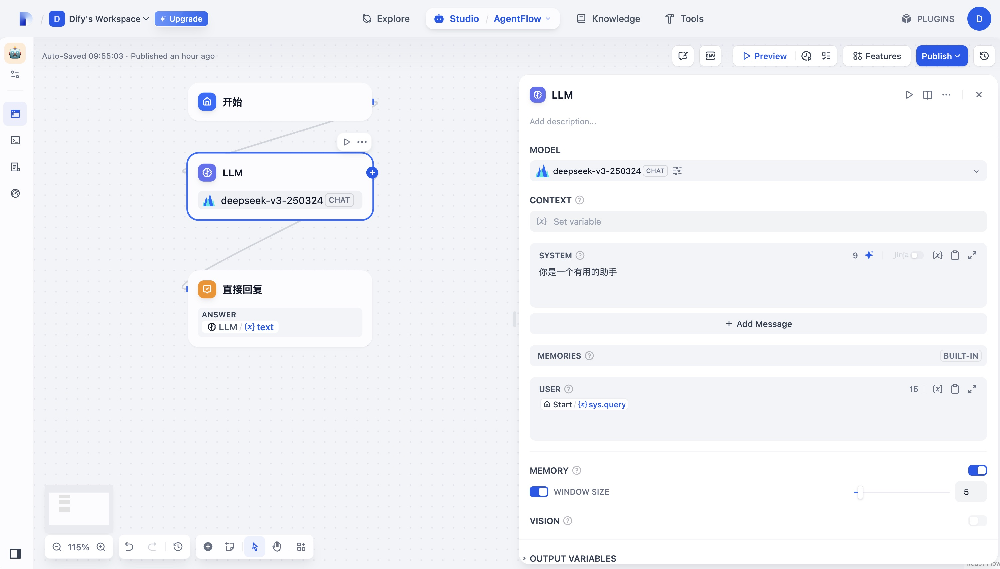
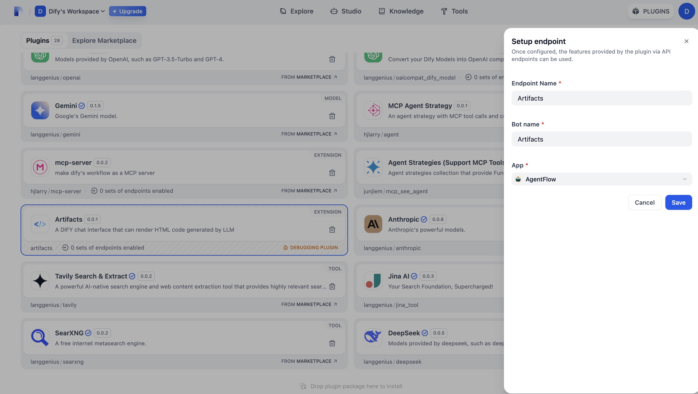
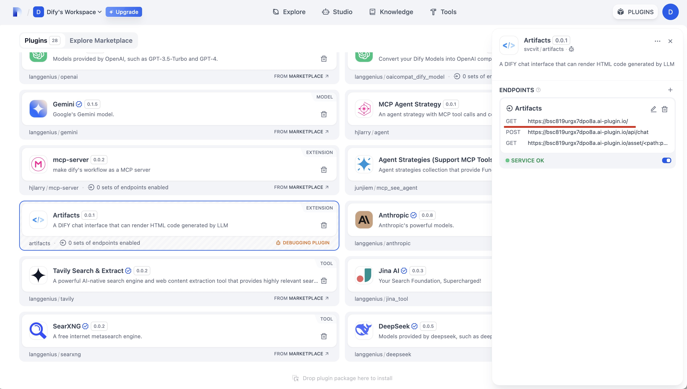

# Artifacts

**Repository:** [dify-plugin-artifacts](https://github.com/svcvit/dify-plugin-artifacts)

### Feature Description

This is a web-based chat interaction interface that can help you automatically render HTML code generated by LLM, as shown below:

### Usage Instructions

1. Configure the chatflow process you need to run

2. Add an endpoint, select the flow created in the first step.

3. Open the first URL to use

### Changelog

#### v0.0.3
- Fixed issue with localhost not working in local Docker deployment

#### v0.0.2
- Added "New Chat" button
- Added canvas rendering
- Fixed output content truncation issues

#### v0.0.1
- Project initialization
- Added HTML code rendering